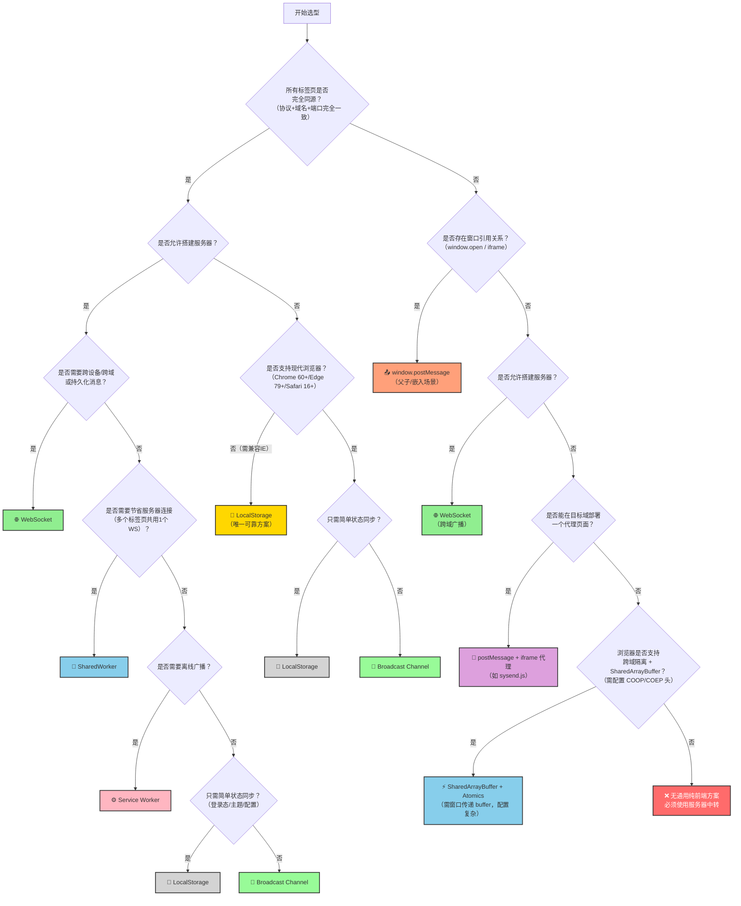

# 多标签页通信方案 

## 📁 目录结构

```
multi-tab-demos/
├── index.html          # 主入口页面
├── common.css          # 公用样式
├── package.json        # npm 依赖管理
├── README.md           # 本文档
├── server/             # 后端相关
│   └── server.js       # WebSocket 广播服务器
├── modules/            # 前端通信方案模块
│   ├── localstorage.js
│   ├── broadcast.js
│   ├── sharedworker.js
│   ├── serviceworker.js
│   ├── postmessage.js
│   └── websocket.js
└── workers/            # Worker 脚本
    ├── worker.js       # SharedWorker 脚本
    └── sw.js           # Service Worker 脚本
```

---

## 🧭 方案选型决策树



### 决策依据速查表

| 决策节点 | 判断依据 | 选择结果 |
| :--- | :--- | :--- |
| **是否同源？** | 跨域时绝大多数本地API被阻断 | 同源→本地方案；跨域→判断窗口引用 |
| **是否有窗口引用？** | 能通过 `window.open` 或 `iframe` 获得目标窗口对象 | 有→`postMessage`；无→服务器中转 |
| **是否允许搭建服务器？** | 服务器方案可打破跨域限制，但增加运维成本 | 是→WebSocket；否→进入纯前端分支 |
| **是否支持现代浏览器？** | Broadcast/SharedWorker 不支持 IE 及 Safari 16 以下 | 不支持→LocalStorage；支持→继续 |
| **是否需维持 WebSocket 长连接？** | SharedWorker 可让所有标签页共用 1 个 WS 连接 | 是→SharedWorker；否→继续 |
| **是否需离线广播？** | Service Worker 在页面关闭后仍可存活 | 是→Service Worker；否→继续 |
| **是否只需简单状态同步？** | 传 Token、颜色值、配置项等低频数据 | 是→LocalStorage；否→继续 |
| **需要实时双向聊天/指令？** | Broadcast Channel 纯内存通信，比 LocalStorage 快 | 是→Broadcast Channel；否→LocalStorage |

---

## 🚀 快速开始

### 1. 安装依赖
```bash
npm install
```

### 2. 启动全部服务（推荐）
```bash
npm start
```
同时启动 WebSocket 服务器 (`server/server.js`) 和静态文件服务。

### 3. 分开启动
- 启动 WebSocket 服务器: `npm run server`
- 启动静态服务: `npm run dev`

### 4. 打开浏览器
访问 `http://localhost:3000` 或 Live Server 提供的地址。

---

## 📋 方案列表

| 方案 | 模块文件 | 需要后端 | 同源 | 跨域 |
|------|---------|---------|------|------|
| LocalStorage | `modules/localstorage.js` | ❌ | ✅ | ❌ |
| Broadcast Channel | `modules/broadcast.js` | ❌ | ✅ | ❌ |
| SharedWorker | `modules/sharedworker.js` | ❌ | ✅ | ❌ |
| Service Worker | `modules/serviceworker.js` | ❌ | ✅ | ❌ |
| window.postMessage | `modules/postmessage.js` | ❌ | ✅ | ✅（需窗口引用） |
| WebSocket | `modules/websocket.js` | ✅（`server/server.js`） | ✅ | ✅ |

---

## 🧪 测试方法

1. 打开多个标签页，访问**完全相同的 URL**（包括端口）
2. 点击顶部按钮切换通信方案
3. 在输入框中发送消息，观察其他标签页是否收到
4. 每条消息都会显示发送者的**标签页 ID**，便于区分

---

## ⚠️ 注意事项

- **同源要求**: 除 WebSocket 和 postMessage（需窗口引用）外，所有方案均要求标签页同源
- **Service Worker**: 必须在 `localhost` 或 HTTPS 下才能注册
- **WebSocket 端口**: 默认 8080，如需修改请调整 `server/server.js` 中的 `PORT` 变量
- **跨域场景**: 不同源且无服务器的场景下，`postMessage + iframe 代理` 是唯一可行的纯前端变通方案
- **已废弃方案**: `document.domain` 降域方案已被主流浏览器禁用，**请勿使用**
